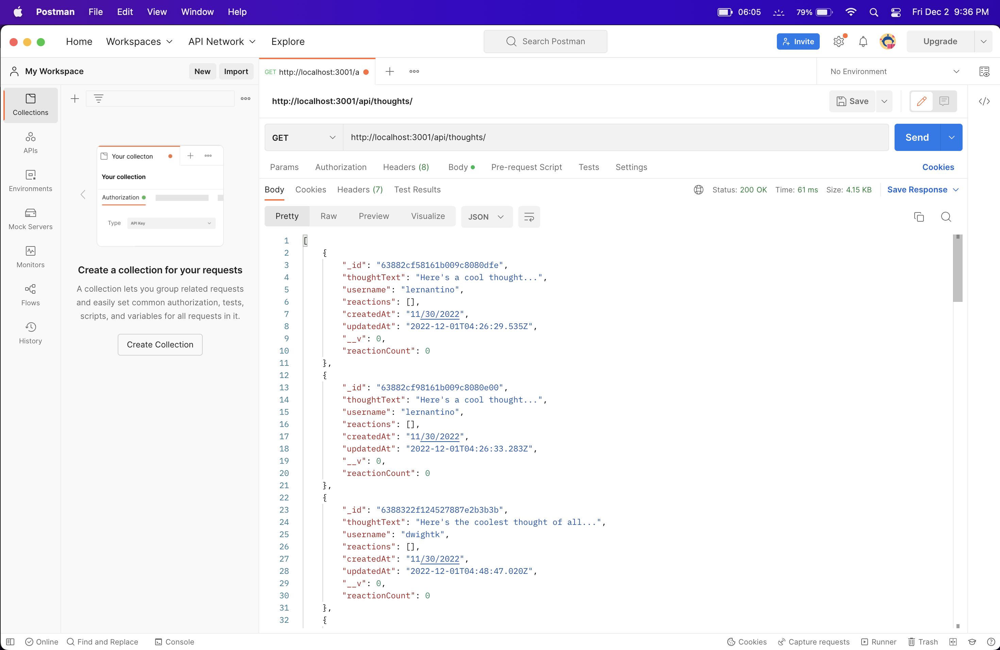
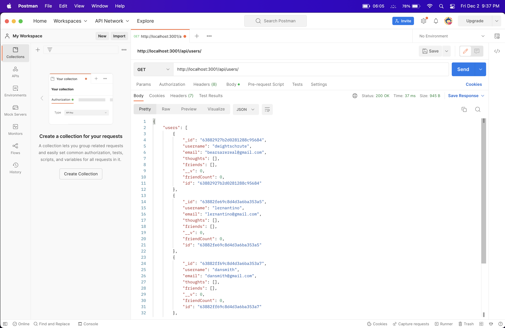

# 

# MongoDB-SocialMediaAPI

## Description
This is an api utilizing technologies from Mongoose and MongoDB to create a database to store users, posts, and comments to those posts along with friends, friend counts and  comment/reaction counts. This would be the backend for a social media network, it allows you to use all CRUD operations on both users and posts with many more functions making it ready for implementation.

## Table of Contents
1. [Installation](#installation)
#
2. [Usage](#usage)
#
3. [License](#license)
#
4. [Contribute](#contributing)
#
5. [Tests](#tests)
#
6. [Screenshots](#screenshots)
#
7. [Questions](#questions)

(<a href="#mit-license">back to top</a>)

## Installation
#
To install, clone the repo into your favorite code editor. Run the command 'npm i' to install the needed dependencies to run this server. Now you should be able to run the command 'npm run dev' and this should start the server up.

(<a href="#mit-license">back to top</a>)

## Usage
#
To use it, run that 'npm run dev' command and then you can use your favorite API Editor such as Postman or Insomnia to access it at 'localhost:3001'. Now go to the routes folder to see what routes to run. All routes will have /api first and everything should work well. You can use the seeds in the seed folder to get you started.

(<a href="#mit-license">back to top</a>)

## License
#
[MIT License](https://opensource.org/licenses/MIT)

(<a href="#mit-license">back to top</a>)

## Contributing
#
Bfunk54/MongoDB-SocialMediaAPI

(<a href="#mit-license">back to top</a>)

## Tests
#
To test, install it, then use it and test all routes available. All functionality should be self-explanitory with the variable names and commenting.

(<a href="#mit-license">back to top</a>)

## Screenshots
#

(<a href="mit-license">back to top</a>)

## Questions
#
Github: https://github.com/Bfunk54
#
Email me with any questions: ben_fein@icloud.com

(<a href="#mit-license">back to top</a>)

## Links
#
[Video Walkthrough]()
#
[Github Repo](https://github.com/Bfunk54/MongoDB-SocialMediaAPI)

(<a href="#mit-license">back to top</a>)

